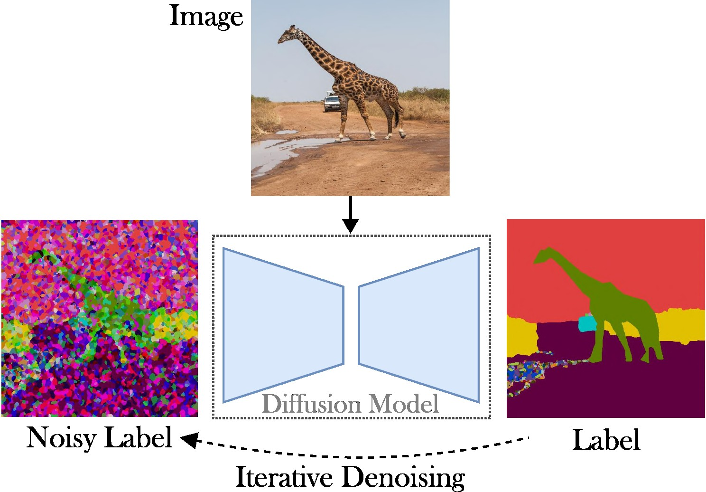
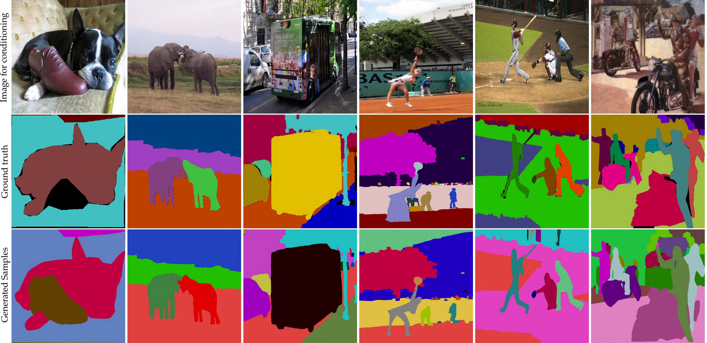

# A Simple Latent Diffusion Approach for Panoptic Segmentation and Mask Inpainting

This repo contains the Pytorch implementation of LDMSeg: a simple latent diffusion approach for panoptic segmentation and Mask inpainting. The provided code inlcudes both the training and evaluation.

> [**A Simple Latent Diffusion Approach for Panoptic Segmentation and Mask Inpainting**](https://arxiv.org/abs/2401.10227)
>
> [Wouter Van Gansbeke](https://wvangansbeke.github.io/) and [Bert De Brabandere](https://scholar.google.be/citations?user=KcMb_7EAAAAJ)
<p align="left">
    

## Contents
1. [Introduction](#-introduction)
0. [Installation](#-installation)
    - [Automatic Installation](#automatic-installation)
    - [Manual Installation](#manual-installation)
0. [Training](#-training)
    - [Step 1: Train Auto-Encoder](#step-1-train-an-auto-encoder-on-panoptic-segmentation-maps)
    - [Step 2: Train LDM](#step-2-train-an-ldm-for-panoptic-segmentation-conditioned-on-rgb-images)
0. [Pretrained Models](#-pretrained-models)
0. [Citation](#-citation)
0. [License](#license)
0. [Acknoledgements](#acknoledgements)


## 📋 Introduction
This paper presents a conditional latent diffusion approach to tackle the task of panoptic segmentation.
The aim is to omit the need for specialized architectures (e.g., region-proposal-networks or object queries), complex loss functions (e.g., Hungarian matching or based on bounding boxes), and additional post-processing methods (e.g., clustering, NMS, or object pasting).
As a result, we rely on Stable Diffusion, which is a task-agnostic framework. The presented approach consists of two-steps: (1) project the panoptic segmentation masks to a latent space with a shallow auto-encoder; (2) train a diffusion model in latent space, conditioned on RGB images.

__Key Contributions__: Our contributions are threefold:

1. __Generative Framework__: We propose a fully
generative approach based on Latent Diffusion Models
(LDMs) for panoptic segmentation. Our approach builds
upon Stable Diffusion to strive for simplicity and to
ease compute. We first study the class-agnostic setup to liberate
panoptic segmentation from predefined classes.
2. __General-Purpose Design__: Our approach circumvents spe-
cialized architectures, complex loss functions, and object
detection modules, present in the majority of prevailing
methods. Here, the denoising objective omits the necessity
for object queries, region proposals, and Hungarian match-
ing. This simple and general approach paves the way
for future extensions to a wide range of dense prediction
tasks, e.g., depth prediction, saliency estimation, etc.
3. __Mask Inpainting__: We successfully apply our approach to
scene-centric datasets and demonstrate its mask inpainting
capabilities for different sparsity levels. 
The approach shows promising results for global mask inpainting.

## 🛠 Installation

The code runs with recent Pytorch versions, e.g. 2.0. 
Further, you can create a python environment with [Anaconda](https://docs.anaconda.com/anaconda/install/):
```
conda create -n LDMSeg python=3.11
conda activate LDMSeg
```
### Automatic Installation
We recommend to follow the automatic installatation (see `tools/scripts/install_env.sh`). Run the following commands to install the project in editable mode. Note that all dependencies will be installed automatically. 
As this might not always work (e.g., due to CUDA or gcc issues), please have a look at the manual installation steps.

```shell
python -m pip install -e .
pip install git+https://github.com/facebookresearch/detectron2.git
pip install git+https://github.com/cocodataset/panopticapi.git
```

### Manual Installation
The most important packages can be quickly installed with pip as:
```shell
pip install torch torchvision einops                            # Main framework
pip install diffusers transformers xformers accelerate timm     # For using pretrained models
pip install scipy opencv-python                                 # For augmentations or loss
pip install pyyaml easydict hydra-core                          # For using config files
pip install termcolor wandb                                     # For printing and logging
```
See `data/environment.yml` for a copy of my environment. We also rely on some dependencies from [detectron2](https://detectron2.readthedocs.io/en/latest/tutorials/install.html) and [panopticapi](https://github.com/cocodataset/panopticapi). Please follow their docs.

## 🗃️ Dataset
We currently support the [COCO](https://cocodataset.org/#download) dataset. Please follow the docs for installing the images and their corresponding panoptic segmentation masks. Also, take a look at the `ldmseg/data/` directory for a few examples on the COCO dataset. As a sidenote, the adopted structure should be fairly standard:
```
.
└── coco
    ├── annotations
    ├── panoptic_semseg_train2017
    ├── panoptic_semseg_val2017
    ├── panoptic_train2017 -> annotations/panoptic_train2017
    ├── panoptic_val2017 -> annotations/panoptic_val2017
    ├── test2017
    ├── train2017
    └── val2017
```

Last but not least, change the paths in `configs/env/root_paths.yml` to your dataset root and your desired output directory respectively.

## ⏳ Training
The presented approach is two-pronged: First, we train an auto-encoder to represent segmentation maps in a lower dimensional space (e.g., 64x64). Next, we start from pretrained Latent Diffusion Models (LDM), particularly Stable Diffusion, to train a model which can generate panoptic masks from RGB images.
The models can be trained by running the the following commands. By default we will train on the COCO dataset with the base config file defined in `tools/configs/base/base.yaml`. Note that this file will be automatically loaded as we rely on the `hydra` package.

### Step 1: Train an Auto-Encoder on Panoptic Segmentation Maps
```python
python -W ignore tools/main_ae.py \
    datasets=coco \
    base.train_kwargs.fp16=True \
    base.optimizer_name=adamw \
    base.optimizer_kwargs.lr=1e-4 \
    base.optimizer_kwargs.weight_decay=0.05
```
More details on passing arguments can be found in `tools/scripts/train_ae.sh`. For example, I run this model for 50k iterations on a single GPU of 23 GB with a total batch size of 16.

### Step 2: Train an LDM for Panoptic Segmentation Conditioned on RGB Images
```python
python -W ignore tools/main_ldm.py \
    datasets=coco \
    base.train_kwargs.gradient_checkpointing=True \
    base.train_kwargs.fp16=True \
    base.train_kwargs.weight_dtype=float16 \
    base.optimizer_zero_redundancy=True \
    base.optimizer_name=adamw \
    base.optimizer_kwargs.lr=1e-4 \
    base.optimizer_kwargs.weight_decay=0.05 \
    base.scheduler_kwargs.weight='max_clamp_snr' \
    base.vae_model_kwargs.pretrained_path='$AE_MODEL'
```
`$AE_MODEL` denotes the path to the model obtained from the previous step.
More details on passing arguments can be found in `tools/scripts/train_diffusion.sh`. For example, I ran this model for 200k iterations on 8 GPUs of 16 GB with a total batch size of 256. 

## 📊 Pretrained Models

We're planning to release several trained models. The (class-agnostic) PQ metric is provided on the COCO validation set.

| Model                      |\#Params | Dataset         | Iters     | PQ     | SQ | RQ | Download link                                                                                           |
|----------------------------|-----|------------|------------|--------|---|---|---------------------------------------------------------------------------------------------------------|
| [AE](#training) |  ~2M   | COCO              | 66k          | -      | - | -  | [Download](https://drive.google.com/file/d/1wmOGB-Ue47DPGFiPxiBFxHv1h5g5Zooe/view?usp=sharing)  (23 MB)  |
| [LDM](#training) | ~800M   | COCO | 200k     | 51.7   | 82.0 |  63.0 | [Download](https://drive.google.com/file/d/1EKuOm_DnSGa0Ff-EkIl6Q1wknZxm4ygB/view?usp=sharing)  (3.3 GB)  |

Note: A less powerful AE (i.e., less downsampling or upsampling layers) can often benefit inpainting, as we don't perform additional finetuning.

The evaluation should look like:
```python
python -W ignore tools/main_ldm.py \
    datasets=coco \
    base.sampling_kwargs.num_inference_steps=50 \
    base.eval_only=True \
    base.load_path=$PRETRAINED_MODEL_PATH \
```
You can add parameters if necessary. Higher thresholds such as `--base.eval_kwargs.count_th 700` or `--base.eval_kwargs.mask_th 0.9` can further boost the numbers. 
However, we use standard values by thresholding at 0.5 and removing segments with an area smaller than 512 for the evaluation.

To evaluate a pretrained model from above, run `tools/scripts/eval.sh`.


Here, we visualize the results:

<p align="left">
    

## 🪧 Citation
If you find this repository useful for your research, please consider citing the following paper:

```bibtex
@article{vangansbeke2024ldmseg,
  title={a simple latent diffusion approach for panoptic segmentation and mask inpainting},
  author={Van Gansbeke, Wouter and De Brabandere, Bert},
  journal={arxiv preprint arxiv:2401.10227},
  year={2024}
}
```
For any enquiries, please contact the [main author](https://github.com/wvangansbeke).

## License

This software is released under a creative commons license which allows for personal and research use only. For a commercial license please contact the authors. You can view a license summary [here](http://creativecommons.org/licenses/by-nc/4.0/).


## Acknoledgements

I'm thankful for all the public repositories (see also references in the code), and in particular for the [detectron2](https://github.com/facebookresearch/detectron2) and [diffusers](https://github.com/huggingface/diffusers) libaries.
